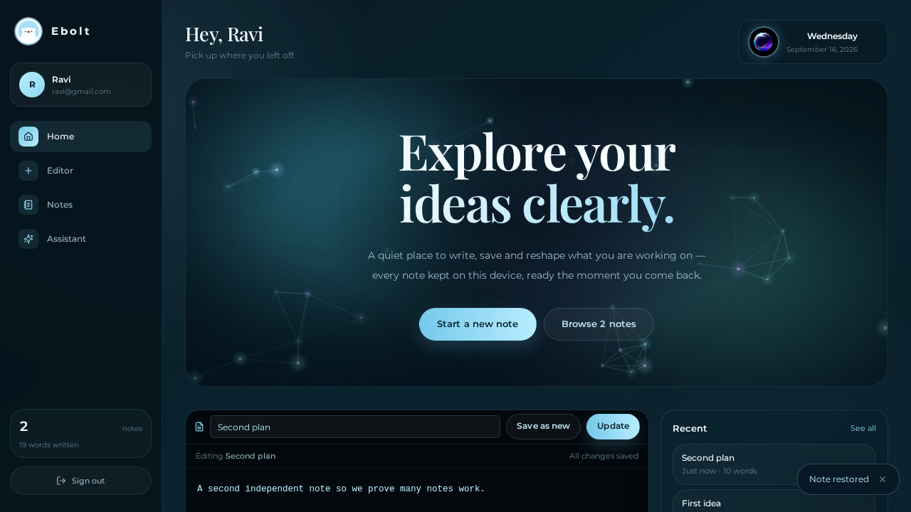

⚡ Ebolt --- Blackbox Workspace

{=html}

<h2 align="center">

A sleek, animated personal workspace for writing, saving and managing
notes.

</h2>

<a href="https://ebolt-1.onrender.com/">{=html}<strong>{=html}🚀
Open Live Website</strong>{=html}</a>{=html}

{=html}

🌐 Live Website

👉 Open Ebolt

Experience the deployed version directly in your browser.

Ebolt is designed as a modern Blackbox workspace with a dark
glass-inspired interface, smooth transitions, animated visual effects,
account-based note organization, and a focused writing experience.

✨ Highlights

⚡ Modern Ebolt UI --- dark, premium and minimal visual design

🪟 Glass-style interface --- layered cards, gradients and subtle
borders

🌌 Animated background --- smooth aurora-style visual effects

🔐 Account-based workspace --- notes are associated with the
signed-in account

📝 Create notes --- quickly write and save personal notes

✏️ Edit notes --- update existing notes without losing their
identity

🗑️ Delete notes --- remove unwanted notes

🔎 Search notes --- quickly find saved content

↕️ Sorting --- organize notes by title, created time or updated
time

📋 Copy content --- copy note text quickly

💬 Chat-style workspace --- interactive workspace experience

📱 Responsive UI --- designed for desktop and smaller screens

🎨 Smooth micro-interactions --- hover, focus and transition
effects

💾 Browser persistence --- account-scoped notes are persisted in
browser storage

Storage note: The current implementation stores account and note
data in the browser's localStorage. It is not a server-side/cloud
vault. Do not use it for highly sensitive information unless the
storage architecture is changed to a secure backend.

🛠️ Tech Stack

Technology           Purpose

⚛️ React 19          UI and component development
🔷 TypeScript        Type-safe application code
🧭 TanStack Router   Client-side routing
⚡ Vite              Fast development and production builds
🎨 Tailwind CSS      Utility-first styling
🧩 Radix UI          Accessible UI primitives
🧠 Zustand           Lightweight client state management
🗃️ PGlite / Kysely   Database-related application infrastructure
🟢 Node.js + Nitro   Production server runtime
🚀 Render            Deployment and hosting
🎯 Lucide React      Interface icons

🖥️ Main Experience

🔐 Account Access

Ebolt provides a focused sign-in experience before entering the personal
workspace.

📝 Notes Workspace

Create notes with:

Title

Content

Creation timestamp

Last updated timestamp

🔎 Search & Sort

Find saved notes and sort them by:

Recently updated

Recently created

Title

✏️ Edit & Delete

Every saved note can be opened, edited, copied or deleted from the
workspace.

🌌 Premium Visual Design

The interface uses:

Animated gradients

Aurora effects

Glass-style cards

Smooth transitions

Responsive layouts

Custom typography

Dark blue/cyan visual language

📂 Project Structure

ebolt/
├── public/
│   ├── ebolt-logo.png
│   ├── favicon.svg
│   └── ...
│
├── src/
│   ├── components/
│   ├── lib/
│   │   ├── auth/
│   │   ├── app-data/
│   │   ├── multiplayer/
│   │   └── ...
│   ├── routes/
│   │   ├── __root.tsx
│   │   └── index.tsx
│   ├── router.tsx
│   └── styles.css
│
├── scripts/
│   ├── migrate.mjs
│   ├── with-app-env.mjs
│   └── ...
│
├── migrations/
├── screenshots/
├── package.json
├── vite.config.ts
├── render.yaml
└── README.md

🚀 Run Locally

1. Clone the repository

git clone YOUR_GITHUB_REPOSITORY_URL
cd ebolt

2. Install dependencies

npm install

3. Start development server

npm run dev

Then open:

http://localhost:8080

🏗️ Production Build

Build the project:

npm run build

Start the production server:

npm start

The production server uses:

.output/server/index.mjs

☁️ Deploy on Render

The project is configured for a Node/Nitro deployment.

Build Command

npm install && npm run build

Start Command

npm start

The production server is started with:

node .output/server/index.mjs

Live deployment

🚀 https://ebolt-1.onrender.com/

🎨 Design Direction

Ebolt follows a premium dark workspace aesthetic:

Deep Navy
    ↓
Glass Panels
    ↓
Cyan / Ice Highlights
    ↓
Aurora Motion
    ↓
Smooth Interactions
    ↓
Focused Workspace

The goal is to keep the interface visually rich without making the
workspace feel cluttered.

🧪 Useful Commands

# Development
npm run dev

# Production build
npm run build

# Production server
npm start

# Type checking
npm run typecheck

# Lint
npm run lint

# Tests
npm test

# Format
npm run format

🔒 Data & Privacy

The current version uses browser-side persistence for account-scoped
notes.

That means:

Data is stored locally in the browser.

Clearing browser storage can remove locally stored data.

Data is not currently a secure cloud backup.

Passwords and sensitive personal information should not be treated
as securely stored credentials in this implementation.

For a production-grade private vault, the next architecture step would
be a proper authentication service plus server-side/database storage
with secure password hashing, authorization rules, file storage and
encrypted sensitive data.

🗺️ Future Improvements

☁️ Cloud database synchronization

🔐 Production-grade authentication

🗂️ Folders and categories

🖼️ Image and document uploads

🔗 Important links manager

👤 Extended profile information

🔄 Cross-device synchronization

🌍 Custom domain

📊 Workspace analytics

📱 Progressive Web App improvements

🔔 Notifications and reminders

📸 Preview

{=html}

⭐ Support

If you like the project, consider giving the repository a ⭐ on GitHub.

👨‍💻 Project

Ebolt --- Blackbox Workspace

Built with React, TypeScript, Vite, Tailwind CSS, TanStack Router and
Nitro.

🚀 Live Demo

https://ebolt-1.onrender.com/

<strong>{=html}⚡ Ebolt</strong>{=html} {=html}
<em>{=html}Write. Save. Organize. Experience your
workspace.</em>{=html}

